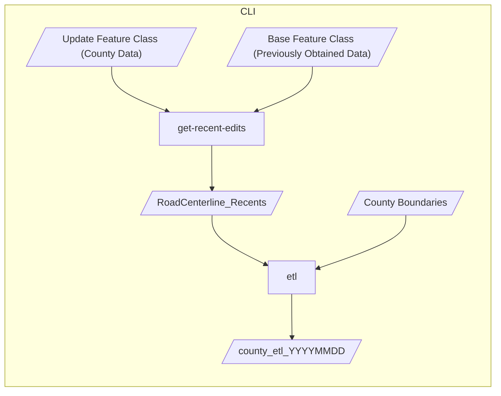

# UTRANS Tools

Tools for working with UTRANS data

## CLI

This is a Python CLI tool for processing county-submitted data prior to ingestion into UTRANS. See its [README](cli/README.md) for installation, usage, and release instructions.

## ArcGIS Pro Add-in

This is an ArcGIS Pro Add-in for working with UTRANS data. See its [README](add-in/README.md) for installation, usage, and release instructions.

## Data Flow

The following diagram shows the flow of data from the county into UTRANS.

